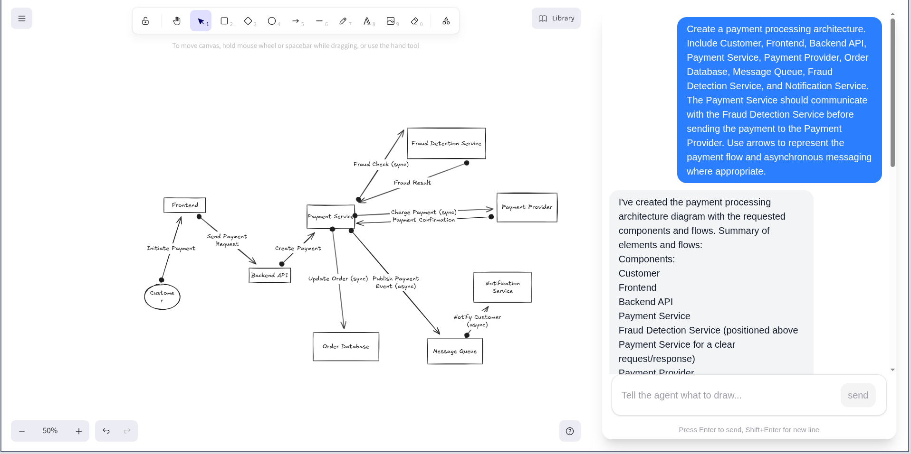
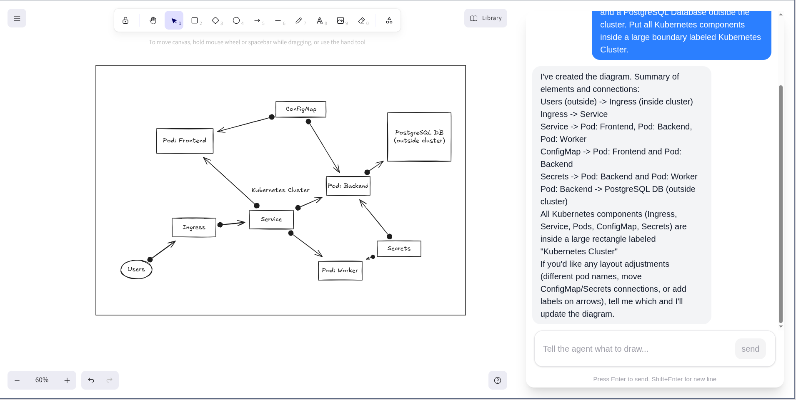

# Excali Agent

Excali Agent is an AI assistant that creates and edits Excalidraw diagrams from text prompts. It connects a chat interface with an interactive Excalidraw canvas, allowing you to generate architecture diagrams, system flows, and technical charts by describing them in plain language.

https://technical-drawing-agent.arhams.workers.dev/

## Examples

Here are examples of diagrams generated by the agent based on user prompts.

### Payment Processing Architecture

Prompt: "Create a payment processing architecture. Include Customer, Frontend, Backend API, Payment Service, Payment Provider, Order Database, Message Queue, Fraud Detection Service, and Notification Service. Use arrows to represent the payment flow and asynchronous messaging where appropriate."



### Kubernetes Cluster Architecture

Prompt: "Create a Kubernetes cluster architecture with Ingress, Service, Pods, ConfigMap, Secrets, and a PostgreSQL Database outside the cluster. Put all Kubernetes components inside a large boundary labeled Kubernetes Cluster."



## Features

- Diagram Generation: Create shapes such as rectangles, diamonds, ellipses, text labels, and connecting arrows directly from chat prompts.
- Canvas Modification: Update existing shapes, change labels, and adjust layout elements based on follow-up requests.
- Element Cleanup: Remove elements and their connected arrows cleanly.
- Interactive Canvas: Full Excalidraw canvas on the left with a chat interface on the right.

## Tech Stack

- Frontend: React 19, Vite, Tailwind CSS, Excalidraw
- Backend: Cloudflare Workers, Cloudflare Durable Objects, Agents SDK
- AI: AI SDK, OpenAI GPT models

## Prerequisites

- Node.js (version 18 or later)
- npm
- OpenAI API key ( I used gpt 5 mini for the above tasks)

## Getting Started

### 1. Clone the repository

```bash
git clone https://github.com/iamArham10/excali-agent.git
cd excali-agent
```

### 2. Install dependencies

```bash
npm install
```

### 3. Configure environment variables

Create a `.dev.vars` file in the project root and add your API keys and credentials:

```env
OPENAI_API_KEY=your_openai_api_key_here

# Optional: Web search tool (Tavily)
TAVILY_API_KEY=your_tavily_api_key_here

# Optional: RAG Knowledge Base (Upstash Vector)
UPSTASH_VECTOR_REST_URL=your_upstash_vector_rest_url
UPSTASH_VECTOR_REST_TOKEN=your_upstash_vector_rest_token
```

### 4. Ingest knowledge base (optional)

If using the RAG knowledge search tool, ingest markdown or code documentation into your Upstash Vector database:

```bash
npm run ingest -- <folder-path> [--reset]
# Example:
npm run ingest -- ./docs --reset
```

### 5. Run the development server

```bash
npm run dev
```

Open your browser and go to `http://localhost:5173` to interact with the agent.

## Available Scripts

- `npm run dev`: Start the local development server.
- `npm run build`: Build the client and server for production.
- `npm run preview`: Preview the production build locally.
- `npm run deploy`: Deploy the application to Cloudflare Workers.
- `npm run test`: Run evaluation tests against the dataset.
- `npm run ingest -- <folder-path>`: Ingest documentation/files into the Upstash Vector knowledge base.
